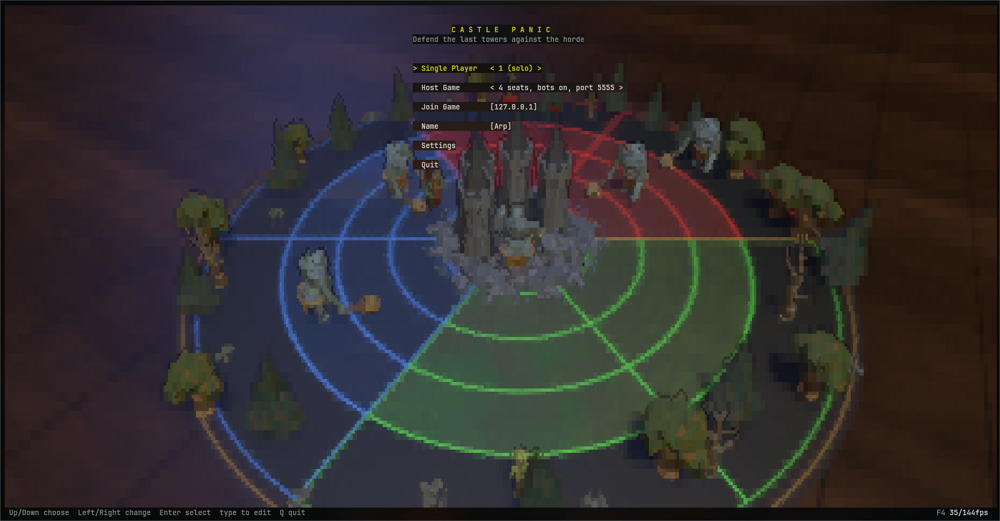
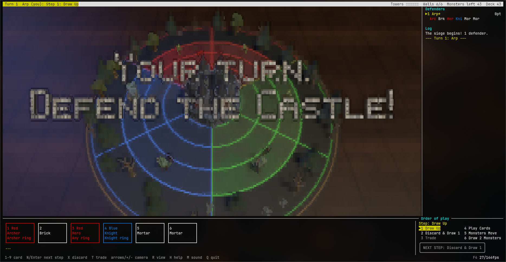
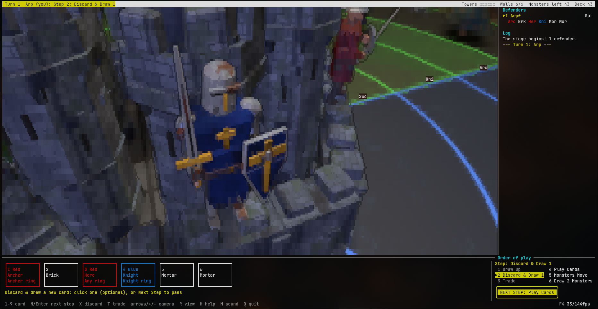

# Castle Panic (terminal 3D)

The cooperative tower-defence board game, played in a terminal and drawn in 3D by
[unicode3d](https://github.com/arp-Trosh/unicode3d): the board on a tabletop, a castle of six towers and walls,
and a horde of goblins, orcs and trolls marching out of the forest, every piece an animated low-poly model.
Linux and Windows (Windows Terminal recommended).







## Play

**Windows**: download the zip from [Releases](https://github.com/arp-Trosh/castlepanic/releases), extract it and
double-click `CastlePanic.exe`; nothing to install (see the README.txt inside). It is built and tested on Windows by
`.github/workflows/windows-release.yml` whenever a `v*` tag is pushed (`packaging/windows/`).

**From source** (Linux, macOS, Windows):

```sh
python3 -m venv .venv && . .venv/bin/activate     # Windows: py -m venv .venv; .venv\Scripts\activate
pip install -r requirements.txt
python3 -m castlepanic [--name NAME] [--no-sound]
```

The first start compiles the renderer (up to a minute). A big terminal with a small font looks best; 100x30 is the
minimum that's comfortable.

- **Single Player**: 1 player is the solo game (hand of 6, discard up to 2); 2-6 fills the other seats with bots.
- **Host Game**: choose seats (2-6), bots on/off (B) and the port (default 5555). The lobby waits for players;
  +/- changes the seats, Enter starts. With bots on, empty seats get bots, and a player who leaves is replaced by one.
- **Join Game**: type the host's address (`host` or `host:port`). Multiplayer has a chat strip at the bottom (Tab).

## Controls

| Key | |
|---|---|
| N, Enter or NEXT STEP | on to the next step of your turn (the Order of play window, bottom right, shows where you are) |
| 1-9 or click | choose a card from your hand; then a letter (or click) picks the Monster, a number the Wall. Brick + Mortar: choose both |
| X | in the Discard step, discard the chosen card and draw (or click it again) |
| T | in the Trade step: your card (or click it), the player, their card (they accept with Y or decline with N) |
| arrows / WASD, +/-, wheel | turn, tilt and zoom the camera; R resets it |
| Esc | cancel a choice; while your trade offer waits for an answer, take it back |
| H or F1 | how to play (F1 while picking by letter, where H is a letter) |
| M | sound on/off |
| Q (twice) | leave the game |
| F2-F6 | glyphs, colours, frame rate, shadows, reflections |

Everything the 3D shows is also in the log on the right (what was played, what moved, what fell).

## Rules

A turn goes in six steps: 1 draw up, 2 discard and draw 1 (solo: 2), 3 trade 1 card with another player (6 players:
2, with one player or two), 4 play cards, 5 the Monsters move, 6 draw 2 new Monsters. Steps 2 and 3 can be
passed. It's co-operative: every hand is open to all, so trade for what the team needs.

Standard Castle Panic: hit Monsters with cards matching their ring and colour, rebuild Walls with Brick + Mortar,
survive all 49 Monster tokens. Most points of slain Monsters is the Master Slayer. The Monster pile's effect tokens
are a best reconstruction of the published mix (see `castlepanic/rules.py`, `TOKENS`).

## Making the art

Every model is a Blender Python script in `assets/src/` (see `assets/STYLE.md` and `assets/src/kit.py`), built with
`blender -b --python assets/src/<name>.py`, and checked with `tools/preview.py`, which renders contact sheets as the
terminal shows them. Sounds are synthesized in `castlepanic/sound.py`. Everything is original.

`ENGINE_NOTES.md` collects what building this game taught about unicode3d.
